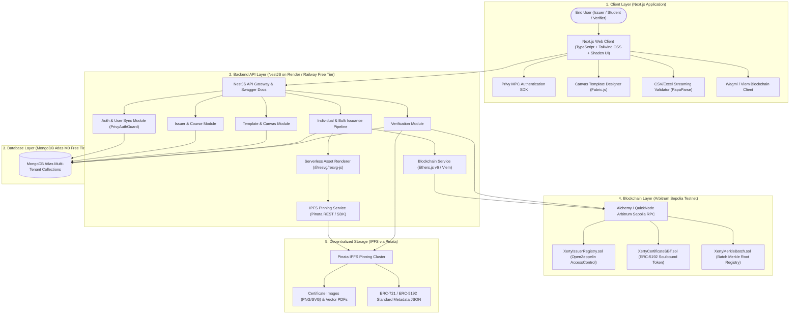
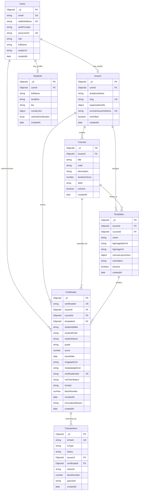
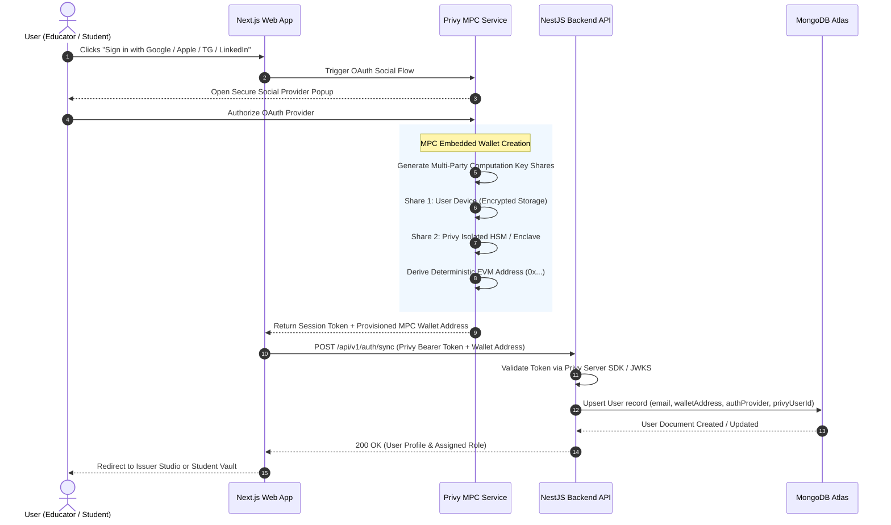
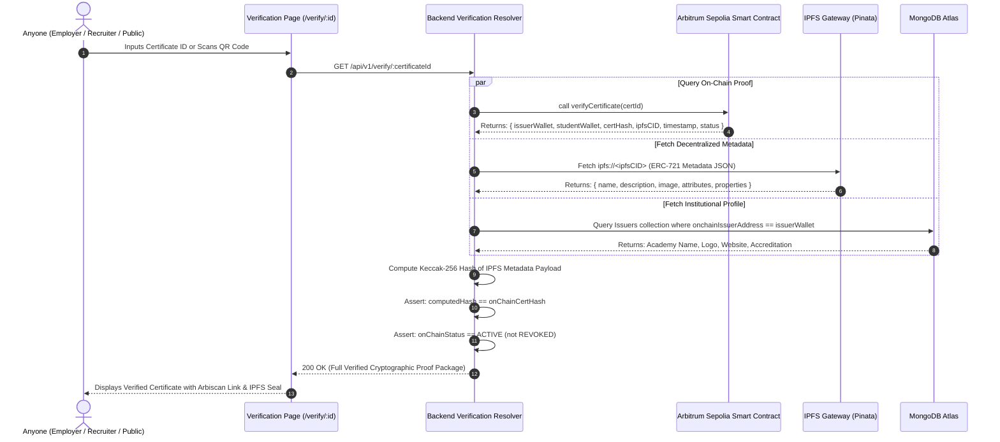

# Production System Architecture: Xerty Platform

---

## 1. Overall System Architecture

The Xerty platform is engineered as a robust, hybrid Web2/Web3 cloud-native ecosystem. It isolates decentralized cryptographic complexity while providing a seamless, sub-second user experience.

### 1.1 End-to-End System Flow

```
User (Issuer / Student / Verifier)
  │
  ▼
Next.js Frontend (App Router, Tailwind CSS, Privy SDK, Fabric.js)
  │
  ▼
Backend API (NestJS Modular REST API, Auth Guards, Queue/Render Engine)
  │
  ▼
MongoDB Atlas (M0 Cloud Database: Users, Profiles, Courses, Templates, Records)
  │
  ▼
Blockchain (Arbitrum Sepolia L2: SBT Smart Contracts, Merkle Batch Registry)
  │
  ▼
IPFS (Pinata Decentralized Pinning: Certificate Images, PDFs, Metadata JSON)
```

### 1.2 High-Level Architecture Topology



---

## 2. Frontend Architecture

The frontend is built on **Next.js 14+ (App Router)** with **TypeScript** and **Tailwind CSS**, optimized for instant rendering, mobile responsiveness, and zero-friction Web3 interactions.

### 2.1 Directory & Page Routing Structure

```
src/
├── app/
│   ├── (auth)/
│   │   └── login/                          # Social & Web3 Login Portal
│   ├── (dashboard)/
│   │   ├── issuer/
│   │   │   ├── page.tsx                    # Issuer Overview Dashboard
│   │   │   ├── profile/page.tsx            # Academy & Organization Profile Settings
│   │   │   ├── courses/
│   │   │   │   ├── page.tsx                # Course Catalog & Management
│   │   │   │   └── new/page.tsx            # Create New Course / Program
│   │   │   ├── templates/
│   │   │   │   ├── page.tsx                # Template Gallery
│   │   │   │   └── designer/page.tsx       # Drag-and-Drop Canvas Designer (Fabric.js)
│   │   │   ├── issue/
│   │   │   │   ├── single/page.tsx         # Single Certificate Issuance
│   │   │   │   └── bulk/page.tsx           # Bulk CSV/Excel Ingestion & Processing
│   │   │   └── certificates/
│   │   │       ├── page.tsx                # Issued Certificates Table & Management
│   │   │       └── [id]/page.tsx           # Certificate Details & Revocation Control
│   │   └── student/
│   │       ├── page.tsx                    # Student Credential Vault
│   │       ├── profile/page.tsx            # Student Public Bio & Portfolio Settings
│   │       └── claim/page.tsx              # 1-Click Certificate Claim Flow
│   ├── verify/
│   │   └── [certificateId]/page.tsx        # Public SSR Verification Page (Open to all)
│   ├── layout.tsx                          # Global Root Layout (Privy & Query Providers)
│   └── page.tsx                            # Landing Page & Public Hero
```

### 2.2 Component Hierarchy & Structure

```
src/components/
├── common/
│   ├── Navbar.tsx                          # Global Header & Dynamic Navigation
│   ├── Footer.tsx                          # Footer with Blockchain Status Pill
│   ├── BrandLogo.tsx                       # Adaptive SVG Logo
│   └── ThemeToggle.tsx                     # Dark/Light Mode Switcher
├── auth/
│   ├── AuthModal.tsx                       # Privy Social Login Modal Trigger
│   ├── UserProfileDropdown.tsx             # Wallet Address / Avatar / Role Switcher
│   └── ProtectedRoute.tsx                  # Client-side RBAC Guard
├── designer/
│   ├── CanvasEditor.tsx                    # Fabric.js Interactive Canvas
│   ├── ElementToolbar.tsx                  # Add Text, Dynamic Variables, QR Code, Signatures
│   ├── FontPicker.tsx                      # Google Fonts Dynamic Loader
│   ├── BackgroundUploader.tsx              # Custom Image/SVG Background with IPFS Pinning
│   └── TemplatePreviewModal.tsx            # Mock Data Previewer
├── issuance/
│   ├── CSVUploader.tsx                     # Drag-and-Drop CSV/Excel Dropzone (PapaParse/xlsx)
│   ├── ColumnMapper.tsx                    # Dynamic CSV Column to Template Tag Mapping
│   ├── BatchValidationTable.tsx            # Live Inline Validation Table & Warning Badges
│   └── IssuanceProgressModal.tsx           # Live Stage Tracker (Rendering -> IPFS -> Minting)
├── student/
│   ├── CertificateCard.tsx                 # 3D Tilt Preview Card with Verified Badge
│   ├── ExportActionMenu.tsx                # Download PDF/PNG, Copy Link, Add to LinkedIn
│   └── ClaimCertificateModal.tsx           # Email-to-Wallet Claim Resolver
└── verify/
    ├── VerificationBadge.tsx               # Cryptographic Valid / Revoked Status Banner
    ├── QRScannerModal.tsx                  # Camera-based Instant QR Code Scanner
    ├── BlockchainProofDetails.tsx          # Arbiscan Tx Hash, Block Height, Issuer Seal
    └── MetadataInspector.tsx               # Raw IPFS JSON Viewer
```

### 2.3 Web3 Integration Layer
- **Privy React SDK**: Handles authentication, social OAuth handshake, session tokens, and automatic MPC wallet provisioning.
- **Wagmi v2 & Viem**: Ultra-lightweight EVM interaction library used for:
  - Reading contract state (`getCertificate`, `isIssuerVerified`, `verifyMerkleProof`).
  - Executing user transactions (`issueCertificate`, `batchIssueCertificates`, `revokeCertificate`).
- **Custom Hooks**:
  - `useXertyContract()`: Typed contract instance binding with auto-switching RPC providers.
  - `useMPCAccount()`: Provides current active wallet address, balance, and chain status.
  - `useCertificateVerification(certId)`: Fetches hybrid on-chain + IPFS verification payload.

### 2.4 State Management Strategy
- **Zustand (Client State)**:
  - `useAuthStore`: Active user role (Issuer/Student), user profile, and authentication token.
  - `useDesignerStore`: Canvas state, active selected element, zoom level, dynamic variable schema, and undo/redo stack.
  - `useBatchStore`: Ingested CSV rows, column mapping state, parsing errors, and batch job status.
- **TanStack Query / React Query v5 (Server State)**:
  - Caches course lists, template registries, student certificates, and verification payloads.
  - Handles automatic background refetching and optimistic mutations.

---

## 3. Backend Architecture (NestJS)

The backend is structured as an enterprise **NestJS modular monolithic API** deployed to cloud serverless/container free tiers (Render / Railway / Fly.io).

### 3.1 Modular Organization

```
src/
├── app.module.ts                           # Root AppModule importing all domain modules
├── main.ts                                 # Entrypoint (CORS, Helmet, Global Pipes, Swagger)
├── modules/
│   ├── auth/                               # Auth.js + Privy JWT validation & guards
│   │   ├── auth.module.ts
│   │   ├── auth.controller.ts
│   │   ├── auth.service.ts
│   │   ├── guards/privy-auth.guard.ts
│   │   └── guards/roles.guard.ts
│   ├── users/                              # User lifecycle & identity sync
│   ├── issuers/                            # Academy profiles & institutional verification
│   ├── students/                           # Student profiles & credential portfolio
│   ├── courses/                            # Course & program catalog management
│   ├── templates/                          # Certificate canvas layouts & variable schemas
│   ├── certificates/                       # Single certificate issuance & query service
│   ├── batches/                            # Bulk CSV ingestion & Merkle root tree generator
│   ├── transactions/                       # On-chain transaction ledger & status tracker
│   ├── verification/                       # Trustless public verification aggregator
│   ├── blockchain/                         # Arbitrum Sepolia RPC provider & Ethers.js service
│   ├── ipfs/                               # Pinata IPFS dual-asset pinning engine
│   └── renderer/                           # High-res SVG/Canvas serverless rendering engine
└── common/
    ├── decorators/                         # @CurrentUser(), @Roles()
    ├── filters/                            # GlobalExceptionFilter (RFC 7807 compliant)
    ├── interceptors/                       # TransformResponseInterceptor, LoggingInterceptor
    └── pipes/                              # ZodValidationPipe / ClassValidatorPipe
```

### 3.2 Core Services & Responsibilities

| Service | Responsibility |
| :--- | :--- |
| `AuthService` | Validates Privy access tokens, resolves identity providers, and manages user sessions. |
| `IssuersService` | Manages academy profiles, authorized signing wallets, and institutional metadata. |
| `CoursesService` | CRUD operations for certification programs, codes, and skills taxonomies. |
| `TemplatesService` | Stores and validates visual canvas layouts (`Fabric.js` JSON) and background asset CIDs. |
| `RendererService` | Renders high-fidelity 300 DPI certificate images (PNG/SVG) using `@resvg/resvg-js` and Canvas. |
| `IpfsService` | Handles multi-part stream uploads to Pinata IPFS; builds ERC-721/5192 standard metadata JSON. |
| `BatchesService` | Streams large CSV/Excel files, validates rows, builds Merkle Trees, and coordinates batch jobs. |
| `BlockchainService` | Interacts with Arbitrum Sepolia contracts; queries on-chain state, validates Merkle proofs, listens to events. |
| `VerificationService` | Aggregates on-chain data, IPFS metadata, and MongoDB academy profiles into a unified verification response. |

### 3.3 REST API Endpoints Overview

```
AUTH & USERS
POST   /api/v1/auth/sync                    # Upsert user upon Privy social/wallet login
GET    /api/v1/users/me                     # Get authenticated user profile

ISSUERS & COURSES
GET    /api/v1/issuers/profile              # Get current issuer organization profile
PUT    /api/v1/issuers/profile              # Update academy details & contact info
GET    /api/v1/courses                      # List issuer courses
POST   /api/v1/courses                      # Create new course
PUT    /api/v1/courses/:id                  # Update course details
DELETE /api/v1/courses/:id                  # Archive course

TEMPLATES
GET    /api/v1/templates                    # List issuer certificate templates
POST   /api/v1/templates                    # Save canvas layout & schema
GET    /api/v1/templates/:id                # Get template detail & layout JSON
POST   /api/v1/templates/upload-bg          # Upload & pin background asset to IPFS

ISSUANCE & BATCHES
POST   /api/v1/certificates/issue-single    # Generate, pin, and prepare single certificate
POST   /api/v1/batches/upload-csv           # Upload CSV, parse, validate rows
POST   /api/v1/batches/process              # Render batch, pin to IPFS, compute Merkle root
GET    /api/v1/batches                      # List batch history & status
GET    /api/v1/certificates/issued          # List all certificates issued by institution
POST   /api/v1/certificates/revoke          # Record certificate revocation with reason

STUDENTS
GET    /api/v1/students/certificates        # List all certificates owned/claimed by student
POST   /api/v1/students/claim               # Claim certificate via email verification

PUBLIC VERIFICATION
GET    /api/v1/verify/:certificateId        # Public verification endpoint (On-chain + IPFS + DB)
```

---

## 4. MongoDB Atlas Architecture

A cloud-hosted **MongoDB Atlas (M0 Cluster)** stores application data, user relationships, and cached blockchain metadata.



### 4.1 Collection Schemas & Indexing Strategy

#### 1. `Users`
- **Indexes**: `{ email: 1 }` (unique, sparse), `{ walletAddress: 1 }` (unique), `{ privyUserId: 1 }` (unique).
- **Role Enum**: `'ISSUER' | 'STUDENT' | 'ADMIN'`.

#### 2. `Issuers`
- **Indexes**: `{ userId: 1 }` (unique), `{ slug: 1 }` (unique), `{ onchainIssuerAddress: 1 }` (unique).
- **Fields**: `academyName`, `slug`, `organizationInfo: { description, website, contactEmail, contactPhone, logoUrl, address }`, `onchainIssuerAddress`, `isVerified`.

#### 3. `Students`
- **Indexes**: `{ userId: 1 }` (unique).
- **Fields**: `fullName`, `headline`, `bio`, `socialLinks: { linkedin, github, twitter }`, `claimedCertificates: [ObjectId]`.

#### 4. `Courses`
- **Indexes**: `{ issuerId: 1 }`, `{ issuerId: 1, code: 1 }` (compound unique).
- **Fields**: `issuerId`, `title`, `code`, `description`, `durationHours`, `skills: [string]`, `isActive`.

#### 5. `Templates`
- **Indexes**: `{ issuerId: 1 }`, `{ courseId: 1 }`.
- **Fields**: `issuerId`, `courseId`, `name`, `bgImageIpfsCid`, `bgImageUrl`, `canvasLayoutJson: { width, height, elements: [...] }`, `orientation`, `isActive`.

#### 6. `Certificates`
- **Indexes**: `{ certificateId: 1 }` (unique), `{ certificateHash: 1 }` (unique), `{ studentWallet: 1 }`, `{ studentEmail: 1 }`, `{ issuerId: 1 }`, `{ onChainStatus: 1 }`.
- **Fields**: `certificateId`, `issuerId`, `courseId`, `templateId`, `studentWallet`, `studentEmail`, `studentName`, `grade`, `score`, `issueDate`, `imageIpfsCid`, `metadataIpfsCid`, `certificateHash`, `onChainStatus` (`'ISSUED' | 'REVOKED'`), `txHash`, `blockNumber`, `revokedAt`, `revocationReason`.

#### 7. `Transactions`
- **Indexes**: `{ txHash: 1 }` (unique), `{ issuerId: 1 }`, `{ certificateId: 1 }`, `{ status: 1 }`.
- **Fields**: `txHash`, `txType` (`'SINGLE_MINT' | 'BATCH_MERKLE_ANCHOR' | 'REVOCATION'`), `status` (`'PENDING' | 'SUCCESS' | 'FAILED'`), `issuerId`, `certificateId`, `network` (`'Arbitrum Sepolia'`), `blockNumber`, `gasUsed`, `createdAt`.

---

## 5. Authentication Architecture

Xerty provides frictionless onboarding for non-technical educators and students by combining **Auth.js** standards with **Privy MPC Embedded Wallets**.

### 5.1 Supported Login Providers
1. **Google OAuth 2.0**
2. **Apple Sign-In**
3. **Telegram Authentication**
4. **LinkedIn OAuth 2.0**
5. **Web3 Wallets** (MetaMask, Coinbase Wallet, Rainbow, WalletConnect)

### 5.2 MPC Wallet Generation Flow



### 5.3 Key Benefits of MPC Architecture
- **No Seed Phrases**: Users never manage 12/24-word recovery phrases.
- **Non-Custodial**: Neither Xerty nor Privy holds the complete private key.
- **Gasless / Seamless Signing**: The embedded wallet signs certificate issuance and claim transactions directly in-browser.

---

## 6. Blockchain Architecture (Arbitrum Sepolia)

```
+---------------------------------------------------------------------------------------------------+
|                                  BLOCKCHAIN SMART CONTRACT SYSTEM                                 |
+---------------------------------------------------------------------------------------------------+
|                                 XertyIssuerRegistry.sol                                           |
|       (Tracks approved institutional issuers, metadata URIs, and administrative roles)            |
+-------------------------------------------------+-------------------------------------------------+
                                                  │
                                                  ▼
+-------------------------------------------------+-------------------------------------------------+
|                                 XertyCertificateSBT.sol                                          |
|        (ERC-721 + ERC-5192 Soulbound Token standard; non-transferable certificate registry)       |
|                                                                                                   |
|  • issueCertificate(...)          • batchIssueCertificates(...)       • revokeCertificate(...)    |
|  • verifyCertificate(...)         • locked(tokenId) => true           • getCertificateByHash(...) |
+-------------------------------------------------+-------------------------------------------------+
                                                  │
                                                  ▼
+-------------------------------------------------+-------------------------------------------------+
|                                  XertyMerkleBatch.sol                                             |
|        (Ultra-low-gas Merkle Root anchor registry for large cohort bulk issuance > 50 certs)      |
+---------------------------------------------------------------------------------------------------+
```

### 6.1 Smart Contract Responsibilities
- **`XertyIssuerRegistry.sol`**: Enforces OpenZeppelin `AccessControl`. Ensures only authorized educational institutions can issue or revoke credentials.
- **`XertyCertificateSBT.sol`**:
  - Implements **ERC-5192 (Minimal Soulbound Tokens)** standard.
  - Overrides `_update` / `transferFrom` / `safeTransferFrom` to unconditionally **revert**, preventing credential transfers or secondary sales.
  - Implements an on-chain revocation registry with timestamp and audit reason.
- **`XertyMerkleBatch.sol`**: Enables an issuer to anchor an entire batch of 1,000+ certificates in a single $O(1)$ gas transaction by publishing only the 32-byte Merkle root.

### 6.2 On-Chain vs Off-Chain Data Separation Matrix

| Field / Asset | Storage Location | Rationale |
| :--- | :--- | :--- |
| **Certificate ID** (`string`) | **Blockchain (On-Chain)** | Canonical credential identifier. |
| **Certificate Hash** (`bytes32` Keccak-256) | **Blockchain (On-Chain)** | Cryptographic seal guaranteeing zero data tampering. |
| **Issuer Wallet Address** (`address`) | **Blockchain (On-Chain)** | Immutable provenance proof of issuing institution. |
| **Student Wallet Address** (`address`) | **Blockchain (On-Chain)** | Soulbound owner identity. |
| **IPFS CID** (`string`) | **Blockchain (On-Chain)** | Immutable pointer to metadata and high-res media. |
| **Block Timestamp** (`uint64`) | **Blockchain (On-Chain)** | Proof of issuance time. |
| **Status** (`uint8`: Active / Revoked) | **Blockchain (On-Chain)** | Instant verifiable revocation status. |
| **Student Personal Details (Name, Email)** | **MongoDB Atlas & IPFS** | Data privacy (GDPR compliance) & off-chain indexing. |
| **Course Details & Syllabus** | **MongoDB Atlas** | Rich text formatting and search optimization. |
| **High-Resolution PNG / Vector PDF** | **IPFS (Pinata)** | Large binary assets cannot be stored cost-effectively on-chain. |
| **Canvas Layout JSON** | **MongoDB Atlas** | Visual designer state management. |

### 6.3 Trustless Verification Process Flow



---

## 7. Security Architecture & Threat Mitigation

```
+---------------------------------------------------------------------------------------------------+
|                                  SECURITY ARCHITECTURE MATRIX                                     |
+-----------------------------------+--------------------------------+------------------------------+
| 1. AUTHENTICATION & API SECURITY  | 2. DATABASE SECURITY           | 3. SMART CONTRACT SECURITY   |
+-----------------------------------+--------------------------------+------------------------------+
| • Privy JWT / JWKS Token Signing  | • MongoDB TLS 1.3 in transit   | • OpenZeppelin v5 Contracts  |
| • Role-Based Access Control (RBAC)| • AES-256 encryption at rest   | • ReentrancyGuard Protection |
| • Rate Limiting (100 req/min)     | • Strict Mongoose DTO schema   | • Soulbound Non-Transferable |
| • Helmet HTTP Security Headers    |   validation & sanitization    | • Slither Static Analysis    |
+-----------------------------------+--------------------------------+------------------------------+
| 4. WALLET & KEY MANAGEMENT        | 5. FILE & STORAGE SECURITY     | 6. COMPLIANCE & PRIVACY      |
+-----------------------------------+--------------------------------+------------------------------+
| • Multi-Party Computation (MPC)   | • IPFS Content-Addressable CIDs| • GDPR "Right to be Forgotten"|
| • Zero private key storage in DB  | • SVG DOMPurify sanitization   |   (No PII on blockchain)     |
| • Non-custodial key sharding      | • File size & MIME validation  | • Anonymized audit logs      |
+-----------------------------------+--------------------------------+------------------------------+
```

### 7.1 Authentication & API Security
- **Privy Token Verification**: All protected backend routes validate cryptographic signatures via Privy's JSON Web Key Set (JWKS).
- **Role-Based Guards**: Custom NestJS `@Roles('ISSUER', 'STUDENT')` decorators enforce strict endpoint authorization.
- **CORS & Headers**: Strict CORS origin whitelisting (`https://xerty.vercel.app`) and Helmet protection (CSP, XSS protection, anti-clickjacking).
- **Rate Limiting**: Throttler module protects issuance endpoints from spam and denial-of-service attempts.

### 7.2 Database Security (MongoDB Atlas)
- **Encryption**: TLS 1.3 encryption for all data in transit; AES-256 encryption for data at rest.
- **Connection Security**: Network access restricted via IP access lists and strict environment variable authentication strings.
- **Injection Prevention**: Parameterized Mongoose queries and class-validator DTOs prevent NoSQL injection.

### 7.3 Smart Contract Security (Arbitrum Sepolia)
- **OpenZeppelin Foundations**: Inherits audited, industry-standard `AccessControl`, `ERC721`, and `ReentrancyGuard` contracts.
- **Soulbound Immutability**: All standard token transfer methods (`transferFrom`, `safeTransferFrom`, `approve`) unconditionally revert.
- **Audit Tooling**: Contracts validated using Slither and Hardhat automated test suites.

### 7.4 Wallet & Key Security
- **Non-Custodial MPC Key Sharding**: Private keys are never constructed or stored on a single server or database.
- **Relayer Isolation**: Backend relayer wallets (used only for automated administrative indexing) store credentials in secure cloud environment secrets with zero public access.

### 7.5 File & Decentralized Storage Security
- **Content Addressing**: IPFS CIDs are immutable cryptographic digests of the files. Any modification generates a completely different CID, guaranteeing tamper resistance.
- **SVG Sanitization**: Canvas SVG exports are sanitized with `DOMPurify` before IPFS pinning to eliminate embedded script execution vectors.
- **MIME & Size Restrictions**: Upload endpoints enforce 5MB limits on backgrounds and accept only validated MIME types (`image/png`, `image/jpeg`, `image/svg+xml`).

