# Database Design & Data Architecture: Xerty

## 1. Database Architecture Overview

The Xerty platform uses a cloud-hosted **PostgreSQL** database (via Supabase / Neon free tier) combined with **Row Level Security (RLS)** for multi-tenant data isolation. The database tracks user profiles, institutional issuers, courses, certificate templates, bulk issuance batches, individual certificates, and verification audit trails.

---

## 2. Entity-Relationship (ER) Diagram

```mermaid
erDiagram
    USERS ||--o| ISSUER_PROFILES : "owns"
    USERS ||--o{ CERTIFICATES : "receives"
    ISSUER_PROFILES ||--o{ COURSES : "creates"
    ISSUER_PROFILES ||--o{ CERTIFICATE_TEMPLATES : "designs"
    ISSUER_PROFILES ||--o{ CERTIFICATE_BATCHES : "issues"
    ISSUER_PROFILES ||--o{ CERTIFICATES : "signs"
    COURSES ||--o{ CERTIFICATE_TEMPLATES : "linked_to"
    COURSES ||--o{ CERTIFICATE_BATCHES : "assigned_to"
    CERTIFICATE_TEMPLATES ||--o{ CERTIFICATE_BATCHES : "used_by"
    CERTIFICATE_TEMPLATES ||--o{ CERTIFICATES : "renders"
    CERTIFICATE_BATCHES ||--o{ CERTIFICATES : "contains"
    CERTIFICATE_BATCHES ||--o{ BATCH_LOGS : "logs"
    CERTIFICATES ||--o{ VERIFICATION_LOGS : "tracks"

    USERS {
        uuid id PK
        string email UK
        string wallet_address UK
        string auth_provider
        string provider_user_id
        string role
        string full_name
        string avatar_url
        timestamp created_at
        timestamp updated_at
    }

    ISSUER_PROFILES {
        uuid id PK
        uuid user_id FK
        string organization_name
        string slug UK
        string description
        string logo_url
        string website
        string verification_status
        string onchain_issuer_address UK
        string tx_hash
        timestamp created_at
        timestamp updated_at
    }

    COURSES {
        uuid id PK
        uuid issuer_id FK
        string title
        string code
        text description
        integer duration_hours
        jsonb skills
        boolean is_active
        timestamp created_at
        timestamp updated_at
    }

    CERTIFICATE_TEMPLATES {
        uuid id PK
        uuid issuer_id FK
        uuid course_id FK
        string name
        string bg_image_ipfs_cid
        string bg_image_url
        jsonb canvas_layout_json
        jsonb variable_schema
        integer width_px
        integer height_px
        string orientation
        boolean is_active
        timestamp created_at
        timestamp updated_at
    }

    CERTIFICATE_BATCHES {
        uuid id PK
        uuid issuer_id FK
        uuid template_id FK
        uuid course_id FK
        string batch_name
        integer total_records
        integer successful_count
        integer failed_count
        string status
        string merkle_root
        string tx_hash
        bigint block_number
        timestamp created_at
        timestamp updated_at
    }

    CERTIFICATES {
        uuid id PK
        uuid batch_id FK
        uuid issuer_id FK
        uuid recipient_user_id FK
        uuid course_id FK
        uuid template_id FK
        string certificate_number UK
        string recipient_name
        string recipient_email
        string recipient_wallet_address
        string grade
        numeric score
        date issue_date
        date expiry_date
        string image_ipfs_cid
        string metadata_ipfs_cid
        string certificate_hash UK
        string token_id UK
        jsonb merkle_proof
        string onchain_status
        string tx_hash
        timestamp revoked_at
        text revocation_reason
        timestamp created_at
        timestamp updated_at
    }

    BATCH_LOGS {
        uuid id PK
        uuid batch_id FK
        integer row_index
        jsonb raw_data
        string status
        text error_message
        timestamp created_at
    }

    VERIFICATION_LOGS {
        uuid id PK
        uuid certificate_id FK
        string verifier_ip_hash
        text user_agent
        timestamp verified_at
    }
```



---

## 3. Detailed Table Definitions (PostgreSQL DDL)

### 3.1 `users` Table
Stores authentication records for all users (both students and institution administrators).

```sql
CREATE TYPE user_role AS ENUM ('STUDENT', 'ISSUER', 'ADMIN');
CREATE TYPE auth_provider_type AS ENUM ('GOOGLE', 'APPLE', 'TELEGRAM', 'LINKEDIN', 'WEB3_WALLET', 'EMAIL');

CREATE TABLE users (
    id UUID PRIMARY KEY DEFAULT gen_random_uuid(),
    email VARCHAR(255) UNIQUE,
    wallet_address VARCHAR(42) UNIQUE NOT NULL, -- MPC embedded address or external Web3 address
    auth_provider auth_provider_type NOT NULL,
    provider_user_id VARCHAR(255),
    role user_role NOT NULL DEFAULT 'STUDENT',
    full_name VARCHAR(255),
    avatar_url TEXT,
    created_at TIMESTAMPTZ NOT NULL DEFAULT NOW(),
    updated_at TIMESTAMPTZ NOT NULL DEFAULT NOW()
);

CREATE INDEX idx_users_wallet ON users(wallet_address);
CREATE INDEX idx_users_email ON users(email);
CREATE INDEX idx_users_role ON users(role);
```

---

### 3.2 `issuer_profiles` Table
Stores institutional metadata, branding, and on-chain issuer authority mapping.

```sql
CREATE TYPE issuer_verification_status AS ENUM ('PENDING', 'VERIFIED', 'SUSPENDED', 'REJECTED');

CREATE TABLE issuer_profiles (
    id UUID PRIMARY KEY DEFAULT gen_random_uuid(),
    user_id UUID NOT NULL REFERENCES users(id) ON DELETE CASCADE,
    organization_name VARCHAR(255) NOT NULL,
    slug VARCHAR(100) UNIQUE NOT NULL,
    description TEXT,
    logo_url TEXT,
    website VARCHAR(255),
    verification_status issuer_verification_status NOT NULL DEFAULT 'PENDING',
    onchain_issuer_address VARCHAR(42) UNIQUE NOT NULL,
    tx_hash VARCHAR(66), -- Registry registration transaction
    created_at TIMESTAMPTZ NOT NULL DEFAULT NOW(),
    updated_at TIMESTAMPTZ NOT NULL DEFAULT NOW()
);

CREATE INDEX idx_issuers_slug ON issuer_profiles(slug);
CREATE INDEX idx_issuers_status ON issuer_profiles(verification_status);
CREATE INDEX idx_issuers_onchain_addr ON issuer_profiles(onchain_issuer_address);
```

---

### 3.3 `courses` Table
Tracks programs, courses, and certifications created by an institution.

```sql
CREATE TABLE courses (
    id UUID PRIMARY KEY DEFAULT gen_random_uuid(),
    issuer_id UUID NOT NULL REFERENCES issuer_profiles(id) ON DELETE CASCADE,
    title VARCHAR(255) NOT NULL,
    code VARCHAR(50) NOT NULL,
    description TEXT,
    duration_hours INTEGER,
    skills JSONB DEFAULT '[]'::jsonb, -- e.g. ["Solidity", "Cryptography", "Full-Stack"]
    is_active BOOLEAN NOT NULL DEFAULT TRUE,
    created_at TIMESTAMPTZ NOT NULL DEFAULT NOW(),
    updated_at TIMESTAMPTZ NOT NULL DEFAULT NOW(),
    CONSTRAINT uq_issuer_course_code UNIQUE (issuer_id, code)
);

CREATE INDEX idx_courses_issuer ON courses(issuer_id);
```

---

### 3.4 `certificate_templates` Table
Stores visual layout configurations, coordinates of dynamic placeholders, and background assets.

```sql
CREATE TABLE certificate_templates (
    id UUID PRIMARY KEY DEFAULT gen_random_uuid(),
    issuer_id UUID NOT NULL REFERENCES issuer_profiles(id) ON DELETE CASCADE,
    course_id UUID REFERENCES courses(id) ON DELETE SET NULL,
    name VARCHAR(255) NOT NULL,
    bg_image_ipfs_cid VARCHAR(100) NOT NULL,
    bg_image_url TEXT NOT NULL,
    canvas_layout_json JSONB NOT NULL, -- Complete Fabric.js canvas state
    variable_schema JSONB NOT NULL, -- List of required and optional CSV fields
    width_px INTEGER NOT NULL DEFAULT 1920,
    height_px INTEGER NOT NULL DEFAULT 1080,
    orientation VARCHAR(20) NOT NULL DEFAULT 'LANDSCAPE',
    is_active BOOLEAN NOT NULL DEFAULT TRUE,
    created_at TIMESTAMPTZ NOT NULL DEFAULT NOW(),
    updated_at TIMESTAMPTZ NOT NULL DEFAULT NOW()
);

CREATE INDEX idx_templates_issuer ON certificate_templates(issuer_id);
CREATE INDEX idx_templates_course ON certificate_templates(course_id);
```

---

### 3.5 `certificate_batches` Table
Tracks asynchronous bulk issuance jobs uploaded via CSV.

```sql
CREATE TYPE batch_status AS ENUM ('QUEUED', 'PROCESSING', 'PINNING_IPFS', 'MINTING_ONCHAIN', 'COMPLETED', 'FAILED');

CREATE TABLE certificate_batches (
    id UUID PRIMARY KEY DEFAULT gen_random_uuid(),
    issuer_id UUID NOT NULL REFERENCES issuer_profiles(id) ON DELETE CASCADE,
    template_id UUID NOT NULL REFERENCES certificate_templates(id),
    course_id UUID REFERENCES courses(id),
    batch_name VARCHAR(255) NOT NULL,
    total_records INTEGER NOT NULL DEFAULT 0,
    successful_count INTEGER NOT NULL DEFAULT 0,
    failed_count INTEGER NOT NULL DEFAULT 0,
    status batch_status NOT NULL DEFAULT 'QUEUED',
    merkle_root VARCHAR(66), -- 0x... Merkle root for O(1) batch anchor
    tx_hash VARCHAR(66), -- Arbitrum Sepolia transaction hash
    block_number BIGINT,
    created_at TIMESTAMPTZ NOT NULL DEFAULT NOW(),
    updated_at TIMESTAMPTZ NOT NULL DEFAULT NOW()
);

CREATE INDEX idx_batches_issuer ON certificate_batches(issuer_id);
CREATE INDEX idx_batches_status ON certificate_batches(status);
```

---

### 3.6 `certificates` Table
The central credential entity linking the recipient, IPFS asset, cryptographic hash, and blockchain token ID.

```sql
CREATE TYPE onchain_cert_status AS ENUM ('PENDING', 'MINTED', 'ANCHORED_MERKLE', 'REVOKED');

CREATE TABLE certificates (
    id UUID PRIMARY KEY DEFAULT gen_random_uuid(),
    batch_id UUID REFERENCES certificate_batches(id) ON DELETE SET NULL,
    issuer_id UUID NOT NULL REFERENCES issuer_profiles(id) ON DELETE RESTRICT,
    recipient_user_id UUID REFERENCES users(id) ON DELETE SET NULL,
    course_id UUID NOT NULL REFERENCES courses(id) ON DELETE RESTRICT,
    template_id UUID NOT NULL REFERENCES certificate_templates(id) ON DELETE RESTRICT,
    certificate_number VARCHAR(100) UNIQUE NOT NULL, -- e.g. "XERTY-2026-08-9842"
    recipient_name VARCHAR(255) NOT NULL,
    recipient_email VARCHAR(255) NOT NULL,
    recipient_wallet_address VARCHAR(42) NOT NULL,
    grade VARCHAR(50),
    score NUMERIC(5,2),
    issue_date DATE NOT NULL DEFAULT CURRENT_DATE,
    expiry_date DATE,
    image_ipfs_cid VARCHAR(100) NOT NULL,
    metadata_ipfs_cid VARCHAR(100) NOT NULL,
    certificate_hash VARCHAR(66) UNIQUE NOT NULL, -- Keccak-256 hash of metadata + payload
    token_id VARCHAR(78) UNIQUE, -- uint256 token ID if directly minted as ERC-721
    merkle_proof JSONB, -- Array of 32-byte hex strings for Merkle verification
    onchain_status onchain_cert_status NOT NULL DEFAULT 'PENDING',
    tx_hash VARCHAR(66),
    revoked_at TIMESTAMPTZ,
    revocation_reason TEXT,
    created_at TIMESTAMPTZ NOT NULL DEFAULT NOW(),
    updated_at TIMESTAMPTZ NOT NULL DEFAULT NOW()
);

CREATE INDEX idx_certs_cert_number ON certificates(certificate_number);
CREATE INDEX idx_certs_hash ON certificates(certificate_hash);
CREATE INDEX idx_certs_token_id ON certificates(token_id);
CREATE INDEX idx_certs_recipient_wallet ON certificates(recipient_wallet_address);
CREATE INDEX idx_certs_recipient_email ON certificates(recipient_email);
CREATE INDEX idx_certs_issuer ON certificates(issuer_id);
CREATE INDEX idx_certs_batch ON certificates(batch_id);
CREATE INDEX idx_certs_status ON certificates(onchain_status);
```

---

### 3.7 `batch_logs` & `verification_logs` Tables

```sql
CREATE TABLE batch_logs (
    id UUID PRIMARY KEY DEFAULT gen_random_uuid(),
    batch_id UUID NOT NULL REFERENCES certificate_batches(id) ON DELETE CASCADE,
    row_index INTEGER NOT NULL,
    raw_data JSONB NOT NULL,
    status VARCHAR(50) NOT NULL, -- 'SUCCESS', 'ERROR'
    error_message TEXT,
    created_at TIMESTAMPTZ NOT NULL DEFAULT NOW()
);

CREATE INDEX idx_batch_logs_batch ON batch_logs(batch_id);

CREATE TABLE verification_logs (
    id UUID PRIMARY KEY DEFAULT gen_random_uuid(),
    certificate_id UUID NOT NULL REFERENCES certificates(id) ON DELETE CASCADE,
    verifier_ip_hash VARCHAR(64) NOT NULL, -- Anonymized SHA-256 hash of IP for privacy
    user_agent TEXT,
    verified_at TIMESTAMPTZ NOT NULL DEFAULT NOW()
);

CREATE INDEX idx_verify_logs_cert ON verification_logs(certificate_id);
```

---

## 4. Standardized JSON Schemas

### 4.1 ERC-721 / ERC-5192 Soulbound Token Metadata JSON Schema
This payload is pinned to IPFS as the `tokenURI` for each certificate:

```json
{
  "$schema": "http://json-schema.org/draft-07/schema#",
  "title": "XertyCertificateMetadata",
  "type": "object",
  "required": [
    "name",
    "description",
    "image",
    "external_url",
    "attributes",
    "properties"
  ],
  "properties": {
    "name": {
      "type": "string",
      "example": "Certificate of Completion: Advanced Smart Contract Engineering"
    },
    "description": {
      "type": "string",
      "example": "This Soulbound credential verifies that Alice Doe has successfully completed the curriculum."
    },
    "image": {
      "type": "string",
      "format": "uri",
      "example": "ipfs://QmX9z7p2.../certificate.png"
    },
    "external_url": {
      "type": "string",
      "format": "uri",
      "example": "https://xerty.app/verify/XERTY-2026-08-9842"
    },
    "attributes": {
      "type": "array",
      "items": {
        "type": "object",
        "properties": {
          "trait_type": { "type": "string" },
          "value": { "type": ["string", "number"] },
          "display_type": { "type": "string" }
        },
        "required": ["trait_type", "value"]
      },
      "example": [
        { "trait_type": "Recipient Name", "value": "Alice Doe" },
        { "trait_type": "Course Title", "value": "Advanced Smart Contract Engineering" },
        { "trait_type": "Course Code", "value": "SOL-301" },
        { "trait_type": "Grade", "value": "Distinction" },
        { "trait_type": "Score", "value": 98.5, "display_type": "number" },
        { "trait_type": "Issue Date", "value": "2026-08-23" },
        { "trait_type": "Issuer Name", "value": "Ethereum Developer Academy" },
        { "trait_type": "Soulbound", "value": "Locked" }
      ]
    },
    "properties": {
      "type": "object",
      "properties": {
        "certificate_id": { "type": "string", "example": "XERTY-2026-08-9842" },
        "certificate_hash": { "type": "string", "example": "0x7f83b1657ff1fc53b92dc18148a1d65dfc2d4b1fa3d677284addd200126d9069" },
        "issuer_address": { "type": "string", "example": "0x1234567890abcdef1234567890abcdef12345678" },
        "recipient_address": { "type": "string", "example": "0xabcdef1234567890abcdef1234567890abcdef12" },
        "network": { "type": "string", "example": "Arbitrum Sepolia (Chain ID: 421614)" },
        "contract_address": { "type": "string", "example": "0x9876543210fedcba9876543210fedcba98765432" }
      }
    }
  }
}
```

---

### 4.2 Canvas Layout Schema (`canvas_layout_json`)
Defines the absolute visual positioning and typography of dynamic fields on the certificate:

```json
{
  "canvas": {
    "width": 1920,
    "height": 1080,
    "background_cid": "ipfs://QmBgImageCID...",
    "background_color": "#ffffff"
  },
  "elements": [
    {
      "id": "elem_student_name",
      "type": "text",
      "variable_binding": "{{recipient_name}}",
      "x": 960,
      "y": 480,
      "origin_x": "center",
      "origin_y": "center",
      "font_family": "Cinzel",
      "font_size": 52,
      "font_weight": "bold",
      "fill": "#1a1a2e",
      "text_align": "center"
    },
    {
      "id": "elem_course_title",
      "type": "text",
      "variable_binding": "{{course_title}}",
      "x": 960,
      "y": 620,
      "origin_x": "center",
      "origin_y": "center",
      "font_family": "Inter",
      "font_size": 32,
      "font_weight": "normal",
      "fill": "#4a4a68",
      "text_align": "center"
    },
    {
      "id": "elem_qr_code",
      "type": "qr_code",
      "variable_binding": "{{verification_url}}",
      "x": 1650,
      "y": 880,
      "width": 180,
      "height": 180,
      "error_correction_level": "H"
    },
    {
      "id": "elem_certificate_id",
      "type": "text",
      "variable_binding": "{{certificate_number}}",
      "x": 1650,
      "y": 1020,
      "font_family": "JetBrains Mono",
      "font_size": 16,
      "fill": "#888899"
    }
  ]
}
```

---

## 5. Security & Row Level Security (RLS) Policies

```sql
-- Enable RLS across all tables
ALTER TABLE users ENABLE ROW LEVEL SECURITY;
ALTER TABLE issuer_profiles ENABLE ROW LEVEL SECURITY;
ALTER TABLE courses ENABLE ROW LEVEL SECURITY;
ALTER TABLE certificate_templates ENABLE ROW LEVEL SECURITY;
ALTER TABLE certificate_batches ENABLE ROW LEVEL SECURITY;
ALTER TABLE certificates ENABLE ROW LEVEL SECURITY;

-- 1. Public Read Policy for Verification
CREATE POLICY "Public certificates can be verified by anyone"
ON certificates FOR SELECT
USING (true);

-- 2. Student Can Read Their Own Certificates
CREATE POLICY "Students can view their certificates"
ON certificates FOR SELECT
USING (recipient_wallet_address = auth.jwt() ->> 'wallet_address' OR recipient_email = auth.jwt() ->> 'email');

-- 3. Issuer Isolation Policy
CREATE POLICY "Issuers manage only their own templates"
ON certificate_templates FOR ALL
USING (issuer_id IN (SELECT id FROM issuer_profiles WHERE user_id = auth.uid()));

CREATE POLICY "Issuers manage only their own batches"
ON certificate_batches FOR ALL
USING (issuer_id IN (SELECT id FROM issuer_profiles WHERE user_id = auth.uid()));
```
