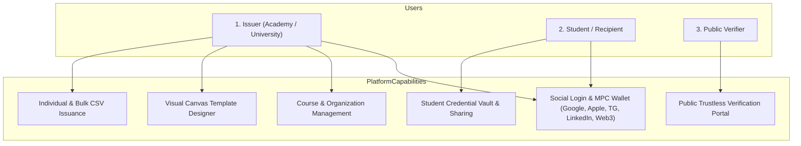
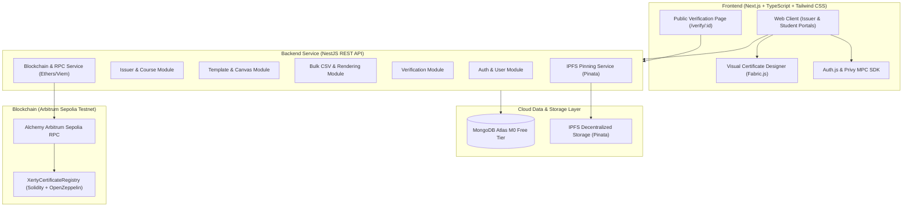

# Project Specification: Xerty — Decentralized Certificate Issuance Platform

---

## 1. Executive Summary & Product Vision

**Xerty** is a production-grade, decentralized certificate and credential issuance ecosystem designed for academies, universities, bootcamps, and professional organizations. It bridges Web2 frictionless accessibility with Web3 cryptographic trust.

The platform enables institutions to issue tamper-proof digital certificates anchored to the **Arbitrum Sepolia Testnet** with metadata and assets pinned to **IPFS**. Users authenticate effortlessly via social accounts (Google, Apple, Telegram, LinkedIn) or standard Web3 wallets, with automated creation of non-custodial embedded Web3 wallets powered by **Multi-Party Computation (MPC)**.

The entire architecture is engineered to run at **$0 development cost**, relying entirely on cloud-hosted free tiers with zero dependency on localhost environments.

---

## 2. Storage & Architecture Separation Rules

To ensure performance, data privacy compliance (GDPR), and cost efficiency, data is strictly segregated into three specialized layers:

```
+---------------------------------------------------------------------------------------------------+
|                                  DATA SEPARATION ARCHITECTURE                                     |
+-----------------------------------+--------------------------------+------------------------------+
| 1. BLOCKCHAIN (Arbitrum Sepolia)  | 2. DATABASE (MongoDB Atlas)    | 3. STORAGE (IPFS)            |
+-----------------------------------+--------------------------------+------------------------------+
| • Certificate ID (UUID/String)    | • Users & Auth accounts        | • High-res Certificate Files |
| • Certificate Hash (Keccak-256)   | • Issuer Profiles & Org info   |   (PNG / SVG / PDF)          |
| • Issuer Wallet Address (0x...)   | • Student Profiles & Portfolios| • ERC-721 / 5192 Metadata    |
| • Student Wallet Address (0x...)  | • Courses & Program Catalogs   |   JSON Payloads              |
| • IPFS CID (TokenURI reference)   | • Certificate Templates & Layout| • Template Background Assets |
| • Timestamp (Block time)          | • Certificate Records & Cache  | • Institutional Badges       |
| • Status (Active, Revoked)        | • Bulk Batches & Ingestion Logs|   and Seal Overlays          |
+-----------------------------------+--------------------------------+------------------------------+
```

---

## 3. User Roles, Personas & Feature Specifications



### 3.1 Issuer (Academy / University / Organization)

#### Authentication & Wallet Onboarding
- **Multi-Provider Login**: Google, Apple, Telegram, LinkedIn, or Web3 wallets (MetaMask, Coinbase, WalletConnect).
- **Automated MPC Wallet**: On social sign-in, an embedded non-custodial Web3 wallet is automatically provisioned via Privy MPC technology. No seed phrase management required.

#### Profile Management
- **Personal Details**: Full name, role/title, avatar.
- **Academy / Organization Profile**: Organization name, slug, description, official website, contact email, phone number, and institutional logo.
- **On-Chain Authority**: Associated issuer wallet address registered with the smart contract registry.

#### Core Issuer Features
1. **Course Management**:
   - Create, edit, and organize courses and certification programs.
   - Store course code, title, description, duration, and associated skills taxonomy.
2. **Certificate Template Designer**:
   - Pre-built standard professional certificate templates.
   - Custom template builder with drag-and-drop canvas designer (Fabric.js).
   - Upload custom high-resolution certificate background designs (PNG/SVG).
   - Place dynamic placeholders:
     - `{{student_name}}`
     - `{{course_title}}`
     - `{{issue_date}}`
     - `{{grade}}` / `{{score}}`
     - `{{certificate_id}}`
     - `{{qr_code}}` (verification link)
     - `{{issuer_signature}}`
3. **Certificate Generation & Issuance**:
   - **Individual Issuance**: Manual single certificate creation with real-time preview.
   - **Bulk Issuance**: Upload CSV / Excel files (`.csv`, `.xlsx`) with instant column mapping and row validation.
   - Automatic background generation of high-resolution certificate assets and metadata.
   - Simultaneous pinning to IPFS.
   - On-chain minting on Arbitrum Sepolia (direct batch mint or Merkle root anchoring).
4. **Certificate Management & Revocation**:
   - Filter, search, and inspect all issued certificates and batches.
   - Revoke certificates on-chain in cases of academic integrity violations or administrative errors, with reason tracking.

---

### 3.2 Student / Recipient

#### Authentication & Wallet
- Login with social accounts (Google, Apple, Telegram, LinkedIn) or Web3 wallets.
- Instant automatic MPC wallet provisioning matching their social identity.

#### Core Student Features
1. **View Certificates**: Interactive dashboard displaying all earned credentials with verified issuer badges.
2. **Claim Certificates**: One-click claim flow linking certificates issued via email to their authenticated MPC wallet.
3. **Download Credentials**: Export crisp, high-resolution vector PDF and PNG certificates with embedded cryptographic verification QR codes.
4. **Shareable Verification Links**:
   - One-click "Add to LinkedIn" certification integration.
   - Shareable verification URL (`https://xerty.app/verify/:certificateId`).
   - Social sharing to X (Twitter) and embeddable verification badges for personal websites and portfolios.

---

### 3.3 Public Verification

#### Unrestricted Access
- Accessible to anyone worldwide without needing an account or login.

#### Core Verification Features
1. **Search Certificate**: Lookup by Certificate ID, Student Wallet, or Transaction Hash.
2. **Verify Certificate Authenticity**:
   - Smart contract query on Arbitrum Sepolia verifying:
     - Certificate existence.
     - Issuing organization registration & validity.
     - Revocation status (Active vs Revoked).
     - Token ownership / Soulbound status.
   - Cryptographic integrity check: Compare on-chain `certHash` with the Keccak-256 hash of the IPFS metadata.
3. **Blockchain Proof Display**:
   - Direct link to Arbiscan block explorer for the minting transaction.
   - Raw IPFS metadata inspection link.
   - Issuer verification stamp and block timestamp confirmation.

---

## 4. Technology Stack & $0 Free-Tier Cloud Strategy

The system is designed to run in production at **$0 development cost** using generous cloud free tiers without any local environment dependencies:

```
+---------------------------------------------------------------------------------------+
|                                    TECH STACK                                         |
+----------------------+----------------------------------------------------------------+
| Frontend Layer       | Next.js (App Router), TypeScript, Tailwind CSS, Shadcn UI      |
| Backend Layer        | Node.js, NestJS (Modular Architecture, REST API, Swagger)       |
| Database Layer       | MongoDB Atlas (M0 Free Tier, Mongoose ODM)                     |
| Authentication & MPC | Auth.js + Privy MPC Embedded Wallet SDK                        |
| Blockchain Layer     | Solidity, Hardhat, OpenZeppelin v5, Arbitrum Sepolia Testnet   |
| RPC & Node Layer     | Alchemy / QuickNode (Arbitrum Sepolia Free Tier)               |
| Decentralized Storage| IPFS via Pinata / Lighthouse Free Tier                         |
| Hosting & Deployment | Vercel (Frontend), Render / Railway Free Tier (NestJS API)     |
+----------------------+----------------------------------------------------------------+
```

### Free-Tier Resource Allocation Matrix

| Service | Provider | Free-Tier Quota | Purpose in Xerty | Cost |
| :--- | :--- | :--- | :--- | :--- |
| **Frontend Hosting** | Vercel | 100GB bandwidth, Edge CDN, HTTPS | Next.js Client App & SSR Verification | **$0.00** |
| **Backend API** | Render / Railway / Fly.io | 512MB RAM, shared CPU, cloud deployment | NestJS REST API & Business Logic | **$0.00** |
| **Database** | MongoDB Atlas | 512MB M0 Cluster, automatic backups | Users, Issuers, Courses, Templates, Logs | **$0.00** |
| **Auth & MPC Wallets** | Privy | 3,000 Monthly Active Users (MAUs) | Social Auth (Google/Apple/TG/LinkedIn) + MPC | **$0.00** |
| **Decentralized Storage**| Pinata IPFS | 1GB storage, 100 pinned files/month | Certificate Images, Metadata JSON, Badges | **$0.00** |
| **Blockchain Testnet**| Arbitrum Sepolia | Layer 2 Testnet (< 0.25s block time) | Immutable Certificate Ledger & SBT Minting | **$0.00** |
| **RPC Provider** | Alchemy / QuickNode | 30,000,000 Compute Units/month | Contract reads, event indexing, tx broadcast | **$0.00** |
| **Testnet Gas** | Arbitrum Faucets | Free testnet ETH | Deploying contracts & on-chain transactions | **$0.00** |
| **Total Cost** | | | | **$0.00** |

---

## 5. System Architecture & High-Level Design



---

## 6. MongoDB Atlas Data Models

### 6.1 `users` Collection
Stores core identity and authentication state.
```json
{
  "_id": "ObjectId",
  "email": "issuer@university.edu",
  "walletAddress": "0x1234567890abcdef1234567890abcdef12345678",
  "authProvider": "GOOGLE",
  "privyUserId": "did:privy:ckxyz...",
  "role": "ISSUER",
  "fullName": "Dr. Sarah Jenkins",
  "avatarUrl": "https://...",
  "createdAt": "ISODate",
  "updatedAt": "ISODate"
}
```

### 6.2 `issuer_profiles` Collection
Institutional identity and organization information.
```json
{
  "_id": "ObjectId",
  "userId": "ObjectId(users)",
  "academyName": "Global Blockchain Academy",
  "slug": "global-blockchain-academy",
  "organizationInfo": {
    "description": "Premier accredited Web3 engineering institute.",
    "website": "https://blockchainacademy.edu",
    "contactEmail": "admissions@blockchainacademy.edu",
    "contactPhone": "+1 (555) 019-2834",
    "logoUrl": "https://...",
    "address": "San Francisco, CA"
  },
  "onchainIssuerAddress": "0x1234567890abcdef1234567890abcdef12345678",
  "isVerified": true,
  "createdAt": "ISODate",
  "updatedAt": "ISODate"
}
```

### 6.3 `student_profiles` Collection
Student portfolio and claimed credentials reference.
```json
{
  "_id": "ObjectId",
  "userId": "ObjectId(users)",
  "fullName": "Alice Doe",
  "headline": "Full-Stack Web3 Developer",
  "bio": "Specializing in Solidity and Next.js dApp development.",
  "socialLinks": {
    "linkedin": "https://linkedin.com/in/alicedoe",
    "github": "https://github.com/alicedoe",
    "twitter": "https://x.com/alicedoe"
  },
  "claimedCertificates": ["ObjectId(certificates)"],
  "createdAt": "ISODate",
  "updatedAt": "ISODate"
}
```

### 6.4 `courses` Collection
Courses and certification programs created by an institution.
```json
{
  "_id": "ObjectId",
  "issuerId": "ObjectId(issuer_profiles)",
  "title": "Advanced Arbitrum Smart Contract Engineering",
  "code": "ARB-401",
  "description": "Deep dive into Layer-2 scaling, Stylus, and Nitro architecture.",
  "durationHours": 60,
  "skills": ["Solidity", "Arbitrum", "ERC-5192", "Hardhat", "DeFi"],
  "isActive": true,
  "createdAt": "ISODate",
  "updatedAt": "ISODate"
}
```

### 6.5 `certificate_templates` Collection
Visual canvas layouts and design configurations.
```json
{
  "_id": "ObjectId",
  "issuerId": "ObjectId(issuer_profiles)",
  "courseId": "ObjectId(courses)",
  "name": "Gold Honor Graduate Template",
  "bgImageIpfsCid": "QmXoypizjW3WknFiJnKLwHCnL72vedxjQkDDP1mXWo6uco",
  "bgImageUrl": "https://gateway.pinata.cloud/ipfs/QmXoyp...",
  "canvasLayoutJson": {
    "width": 1920,
    "height": 1080,
    "elements": [
      {
        "id": "student_name",
        "type": "text",
        "tag": "{{student_name}}",
        "x": 960,
        "y": 480,
        "fontSize": 48,
        "fontFamily": "Cinzel",
        "fill": "#1a1a2e",
        "textAlign": "center"
      },
      {
        "id": "qr_code",
        "type": "qr_code",
        "tag": "{{qr_code}}",
        "x": 1650,
        "y": 880,
        "width": 160,
        "height": 160
      }
    ]
  },
  "orientation": "LANDSCAPE",
  "isActive": true,
  "createdAt": "ISODate",
  "updatedAt": "ISODate"
}
```

### 6.6 `certificates` Collection
Central credential records linking MongoDB, IPFS, and Arbitrum Sepolia.
```json
{
  "_id": "ObjectId",
  "certificateId": "XERTY-2026-08-9842",
  "issuerId": "ObjectId(issuer_profiles)",
  "courseId": "ObjectId(courses)",
  "templateId": "ObjectId(certificate_templates)",
  "studentWallet": "0xabcdef1234567890abcdef1234567890abcdef12",
  "studentEmail": "student@example.com",
  "studentName": "Alice Doe",
  "grade": "Distinction",
  "score": 98.5,
  "issueDate": "2026-08-23T00:00:00.000Z",
  "imageIpfsCid": "QmCertificateImageCID...",
  "metadataIpfsCid": "QmMetadataJSONCID...",
  "certificateHash": "0x7f83b1657ff1fc53b92dc18148a1d65dfc2d4b1fa3d677284addd200126d9069",
  "onChainStatus": "ISSUED",
  "txHash": "0x3a1b2c...",
  "blockNumber": 12849204,
  "revokedAt": null,
  "revocationReason": null,
  "createdAt": "ISODate",
  "updatedAt": "ISODate"
}
```

---

## 7. Smart Contract Architecture (Arbitrum Sepolia)

### 7.1 Contract Specification
- **Language**: Solidity `^0.8.24`
- **Libraries**: OpenZeppelin Contracts v5.0 (`AccessControl`, `ERC721`, `ERC5192`)
- **Network**: Arbitrum Sepolia Testnet (Chain ID: `421614`)

### 7.2 On-Chain Data Model
```solidity
struct Certificate {
    string certificateId;      // Unique human-readable identifier
    bytes32 certHash;          // Keccak-256 hash of metadata payload
    address issuerWallet;      // Registered institution wallet
    address studentWallet;     // Recipient address (MPC / External)
    string ipfsCID;            // IPFS TokenURI reference
    uint64 timestamp;          // Minting block timestamp
    CertificateStatus status;  // 0: INACTIVE, 1: ISSUED, 2: REVOKED
}
```

### 7.3 Core Smart Contract Functions
1. `issueCertificate(string certId, bytes32 certHash, address student, string ipfsCID)`
2. `batchIssueCertificates(string[] certIds, bytes32[] certHashes, address[] students, string[] ipfsCIDs)`
3. `anchorBatchMerkle(bytes32 batchId, bytes32 merkleRoot, uint32 count)`
4. `revokeCertificate(string certId, string reason)`
5. `verifyCertificate(string certId)` (Returns all verification fields and status)
6. `locked(uint256 tokenId)` (ERC-5192 Soulbound standard: Returns `true` to enforce non-transferability)

---

## 8. Non-Functional & Security Architecture

| Category | Measure / Implementation |
| :--- | :--- |
| **Key Security** | Non-custodial MPC key splitting via Privy. No private keys stored in MongoDB or handled in plaintext. |
| **Immutability** | Cryptographic Keccak-256 hashes permanently sealed on Arbitrum Sepolia; tampering invalidates verification. |
| **Credential Transfer Prevention** | Soulbound Token (ERC-5192) standard prevents academic credentials from being traded or transferred. |
| **Data Privacy (GDPR)** | PII (names, contact info, grades) stored in MongoDB; only anonymous hashes and public IPFS pointers exist on-chain. |
| **Performance** | Sub-second verification responses using Next.js Server-Side Rendering and Edge CDN caching. |
| **Cost Optimization** | Merkle tree batch anchoring allows hundreds of certificates to be anchored in a single low-gas L2 transaction. |

