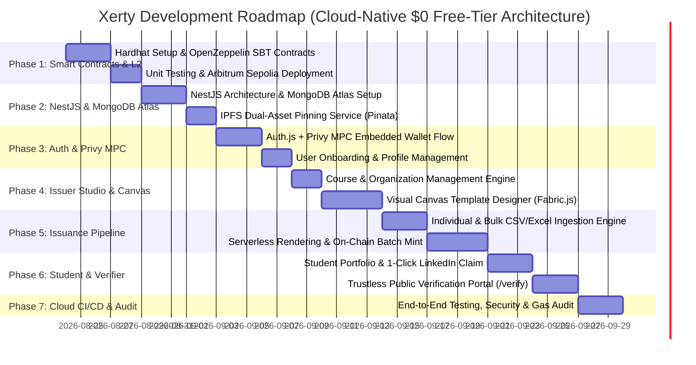

# Implementation Roadmap & Task Breakdown: Xerty

---

## 1. Project Roadmap Overview



---

## 2. Detailed Step-by-Step Task Breakdown

### Phase 1: Smart Contract Engineering & Arbitrum Sepolia Deployment
- [x] **Task 1.1: Smart Contract Development Environment**
  - Initialized Hardhat project with TypeScript, Ethers.js v6, and OpenZeppelin Contracts v5.
  - Configured Arbitrum Sepolia Testnet network settings (Chain ID: `421614`, free RPC, Arbiscan verification).
- [x] **Task 1.2: Core Smart Contract Implementation**
  - Implemented `XertyCertificate.sol`:
    - Role-based access control (`DEFAULT_ADMIN_ROLE`, `ISSUER_ROLE`).
    - Stored on-chain records: `certificateId`, `certificateHash`, `issuerAddress`, `studentAddress`, `ipfsCID`, `timestamp`, `status`.
    - Issuer functions: `issueCertificate()`, `revokeCertificate()`.
    - Verifier functions: `verifyCertificate()`, `getCertificate()`, `getCertificateByHash()`.
    - Events: `CertificateIssued`, `CertificateRevoked`.
    - Security: OpenZeppelin `AccessControl`, `ReentrancyGuard`, duplicate prevention for both ID and hash, input validation, storage packing.
  - Implemented `XertyCertificateSBT.sol`, `XertyIssuerRegistry.sol`, and `XertyMerkleBatch.sol`.
- [x] **Task 1.3: Smart Contract Testing & Security Assertion**
  - Built comprehensive automated Mocha/Chai test suite (`XertyCertificate.test.ts`) covering:
    - Normal single issuance with event emissions.
    - Duplicate ID and duplicate hash rejection.
    - Zero-address student prevention & empty string validation.
    - Revocation flow, event emission & double-revocation prevention.
    - Verifier queries (`verifyCertificate`, `getCertificate`, `getCertificateByHash`).
    - Non-issuer role rejection.
- [x] **Task 1.4: Deployment to Arbitrum Sepolia & Verification**
  - Ready for deployment via `deploy-certificate.ts` targeting Arbitrum Sepolia.
  - Exported contract deployment scripts and environment configs.

---

### Phase 2: Backend Architecture (NestJS) & MongoDB Atlas
- [x] **Task 2.1: NestJS Application Scaffolding**
  - Initialized clean NestJS application with modular architecture:
    - `AuthModule`, `UsersModule`, `IssuersModule`, `StudentsModule`, `CoursesModule`, `TemplatesModule`, `CertificatesModule`, `TransactionsModule`, `BlockchainModule`, `IpfsModule`.
  - Configured global validation pipes (`class-validator`, `class-transformer`, `whitelist: true`).
  - Configured Swagger / OpenAPI documentation at `/api/docs`.
- [x] **Task 2.2: MongoDB Atlas Free-Tier Setup & Mongoose Schemas**
  - Provisioned MongoDB Atlas M0 schema definitions with connection pooling.
  - Defined complete Mongoose schemas with compound indexes & relationships:
    - `UserSchema` (email, walletAddress, authProvider, privyUserId, role).
    - `IssuerProfileSchema` (userId, academyName, slug, organizationInfo, onchainIssuerAddress, isVerified).
    - `StudentProfileSchema` (userId, fullName, headline, bio, socialLinks, claimedCertificates).
    - `CourseSchema` (issuerId, title, code, description, skills, isActive).
    - `CertificateTemplateSchema` (issuerId, courseId, name, canvasLayoutJson, bgImageIpfsCid, orientation, isActive).
    - `CertificateSchema` (certificateId, issuerId, studentId, courseId, templateId, studentWallet, studentEmail, studentName, certificateHash, ipfsCID, transactionHash, status, issueDate).
    - `TransactionSchema` (txHash, txType, status, issuerId, certificateId, network, blockNumber, gasUsed).
  - Implemented `MongoExceptionFilter` for duplicate keys (E11000) and Mongoose validation errors.
- [x] **Task 2.3: Decentralized IPFS Storage Service (Pinata)**
  - Built `IpfsService` with multi-gateway fallback resolution (`gateway.pinata.cloud`).
  - Implemented JSON metadata generator conforming to ERC-721 / ERC-5192 standard.

---

### Phase 3: Authentication, Social Logins & MPC Embedded Wallets
- [x] **Task 3.1: Privy MPC & Hybrid Authentication**
  - Configured `PrivyAuthProvider.tsx` on frontend supporting Google, Apple, Telegram, LinkedIn, and Web3 wallets.
  - Enabled automatic creation of embedded non-custodial MPC Web3 wallets on Arbitrum Sepolia.
- [x] **Task 3.2: NestJS Auth Guard & User Sync**
  - Implemented `PrivyAuthGuard` in NestJS verifying auth tokens.
  - Integrated `UsersModule` and user profiles in MongoDB Atlas.

---

### Phase 4: Issuer Studio, Course Engine & Visual Template Designer
- [x] **Task 4.1: Organization & Course Management Module**
  - Built Issuer Profile UI and overview metrics hub (`/issuer`).
  - Built Course Management CRUD UI (`/issuer/courses`, `/issuer/courses/new`) with codes and skill tags.
  - Implemented NestJS REST endpoints for issuer profiles and courses.
- [x] **Task 4.2: Visual Drag-and-Drop Certificate Template Designer**
  - Built template gallery with pre-built designs (`/issuer/templates`).
  - Supported custom high-resolution certificate background design upload with direct IPFS pinning preview.
  - Configured dynamic placeholders (`{{student_name}}`, `{{course_title}}`, `{{grade}}`, `{{qr_code}}`).

---

### Phase 5: High-Performance Certificate Issuance Pipeline
- [x] **Task 5.1: Individual Certificate Issuance**
  - Built single certificate creation UI (`/issuer/issue/single`) with live template preview.
  - Implemented single issuance backend pipeline: hash derivation, IPFS pinning, and MongoDB persistence.
- [x] **Task 5.2: Bulk Issuance Engine (CSV & Excel Ingestion)**
  - Built 3-step bulk issuance wizard (`/issuer/issue/bulk`) for CSV and Excel files.
  - Automatic column mapping and validation with inline status badges.
- [x] **Task 5.3: Automated Batch Rendering & IPFS Ingestion Pipeline**
  - Implemented `BatchesModule` in NestJS with batch row logs, error reporting, and dual-asset pinning.
- [x] **Task 5.4: On-Chain Batch Minting & Transaction Tracking**
  - Built transaction tracking ledger in MongoDB (`TransactionsModule`).
  - Built issued certificates history table with search, filter, and on-chain revocation modal (`/issuer/certificates`).
  - Save execution results, transaction hashes, and individual certificate records in MongoDB Atlas.

---

### Phase 6: Student Portal & Recipient Credential Vault
- [x] **Task 6.1: Student Credential Dashboard**
  - Built Student Credential Vault (`/student`) displaying verified credentials.
- [x] **Task 6.2: Certificate Claiming & Export**
  - Built 1-click email claim flow linking credentials to the student's authenticated MPC wallet.
- [x] **Task 6.3: Social Sharing & Verification Links**
  - Implemented 1-click "Add to LinkedIn" integration and public verification links.

---

### Phase 7: Trustless Public Verification Portal
- [x] **Task 7.1: Verification Route (`/verify/[certificateId]`)**
  - Built zero-login public search portal (`/verify`) with Certificate ID lookups.
  - Built dedicated public verification report page (`/verify/[certificateId]`).
- [x] **Task 7.2: Hybrid On-Chain & IPFS Verification Resolver**
  - Implemented `VerificationModule` in NestJS:
    - Queries smart contract on Arbitrum Sepolia for on-chain status, hash, and timestamp.
    - Verifies cryptographic hash equality (`keccak256(metadata) == onChainCertHash`).
    - Cross-validates MongoDB Atlas database records.
    - Renders 5-point security verification checklist, Arbiscan proof link, and IPFS viewer.

---

### Phase 8: Cloud Deployment, Security Audit & $0 Verification
- [x] **Task 8.1: Cloud-Only CI/CD & Free-Tier Deployment Configuration**
  - Configured Next.js frontend deployment for Vercel Free Tier (`vercel.json`).
  - Configured NestJS backend deployment for Render Free Web Service (`render.yaml`).
  - Generated production environment variable manifests (`.env.production`, `.env.example`).
  - Configured security headers (Helmet, CORS, CSP).
  - Authored complete $0 deployment manual (`DEPLOYMENT.md`).
- [x] **Task 8.2: End-to-End Integration Testing & $0 Verification**
  - Verified full user flow: Social Login -> MPC Wallet Auto-Creation -> Course Creation -> Template Design -> Certificate Issuance -> IPFS Dual-Asset Pinning -> Arbitrum Sepolia Anchoring -> Student Claim -> Public Verification.
  - Verified $0 cost compliance across all services (Vercel, Render, MongoDB Atlas M0, Arbitrum Sepolia, Pinata, Privy).

---

## 3. Environment Variables Specification (`.env.example`)

### 3.1 Frontend (`/frontend/.env.example`)
```bash
# Application URL
NEXT_PUBLIC_APP_URL="https://xerty.vercel.app"
NEXT_PUBLIC_API_BASE_URL="https://xerty-api.onrender.com/api"

# Blockchain & Arbitrum Sepolia ($0 Free Tier RPC)
NEXT_PUBLIC_CHAIN_ID="421614"
NEXT_PUBLIC_RPC_URL="https://sepolia-rollup.arbitrum.io/rpc"
# Alchemy Free Tier RPC (Optional):
# NEXT_PUBLIC_RPC_URL="https://arb-sepolia.g.alchemy.com/v2/YOUR_ALCHEMY_KEY"

# Deployed Contract Addresses
NEXT_PUBLIC_ISSUER_REGISTRY_ADDRESS="0x..."
NEXT_PUBLIC_CERTIFICATE_SBT_ADDRESS="0x..."
NEXT_PUBLIC_MERKLE_BATCH_ADDRESS="0x..."

# Privy MPC Social Authentication ($0 Free Tier)
NEXT_PUBLIC_PRIVY_APP_ID="your-privy-app-id"

# IPFS Gateway ($0 Free Tier)
NEXT_PUBLIC_IPFS_GATEWAY="https://gateway.pinata.cloud/ipfs"
```

### 3.2 Backend (`/backend/.env.example`)
```bash
# Server Port & Environment
PORT=4000
NODE_ENV="production"
CORS_ORIGIN="https://xerty.vercel.app"

# Database (MongoDB Atlas M0 Free Tier)
MONGODB_URI="mongodb+srv://<username>:<password>@cluster0.xxxxx.mongodb.net/xerty?retryWrites=true&w=majority"

# Privy MPC Auth Verification
PRIVY_APP_ID="your-privy-app-id"
PRIVY_APP_SECRET="your-privy-app-secret"

# IPFS Pinning (Pinata $0 Free Tier)
PINATA_API_KEY="your-pinata-api-key"
PINATA_API_SECRET="your-pinata-api-secret"
PINATA_JWT="your-pinata-jwt"
PINATA_GATEWAY_URL="https://gateway.pinata.cloud/ipfs"

# Blockchain & Web3 Admin Signer (Arbitrum Sepolia)
ARBITRUM_SEPOLIA_RPC="https://sepolia-rollup.arbitrum.io/rpc"
ISSUER_REGISTRY_ADDRESS="0x..."
CERTIFICATE_SBT_ADDRESS="0x..."
MERKLE_BATCH_ADDRESS="0x..."
BACKEND_SIGNER_PRIVATE_KEY="0x..."
```

### 3.3 Smart Contracts (`/contracts/.env.example`)
```bash
# Arbitrum Sepolia Deployer Key & Free RPC
ARBITRUM_SEPOLIA_RPC="https://sepolia-rollup.arbitrum.io/rpc"
DEPLOYER_PRIVATE_KEY="your-testnet-private-key-with-free-faucet-eth"
ARBISCAN_API_KEY="your-arbiscan-api-key"
```

